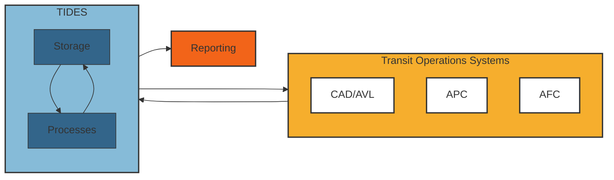

# TIDES

TIDES is the Transit ITS Data Exchange Specification and is your key to accessing, managing, and using transit operations data.

## Why TIDES?

TIDES is a data specification for transit operations data including vehicle location data, passenger count data, and fare transaction data.

- For **transit agencies**, TIDES simplifies data access and offers industry best practice tools to improve data quality, integrate data sources, and create the reports and tools you need to plan and manage service.
- For **consultants, researchers, and partners**, TIDES simplifies access to agency data and allows creation of standard reports and tools across agencies and data sets.
- For **ITS system vendors**, TIDES makes it easier to give your customers access to their data and allows them to use the data in more ways.

TIDES frees your transit data and gives you more options to turn operations data into information on ridership, passenger loads, fare revenue, vehicle speed and delay, service reliability, and more!



TIDES is open-source, free for use, and is community governed, developed and supported. This repository provides data schemas and tools to support the access, management, and improvement of historical transit operations data, including vehicle operations, passenger activity, fare collection, and other similar data.

[architecture]:./docs/architecture.md
[table schemas]:./docs/tables.md
[tides-datapackage-profile]:./docs/datapackage.md
[samples]:./samples
[template-datapackage]:./samples/template/TIDES/datapackage.json
[contributing]:./CONTRIBUTING.md
[github issues]:https://github.com/TIDES-transit/TIDES/issues
[frictionless table schema]:https://specs.frictionlessdata.io/table-schema/
[frictionless data package schema]:https://specs.frictionlessdata.io/data-package/
[frictionless framework]: (https://framework.frictionlessdata.io/)
[tcrp report]: https://nap.nationalacademies.org/catalog/26674/improving-access-and-management-of-public-transit-its-data

## TIDES specification

The TIDES specification is maintained in the `/spec` sub-directory as a series of JSON tables compatible with the [frictionless table schema] standards.
Human-friendlier documentation is auto-generated and available at:

- [Architecture][architecture]
- [Table Schemas][table schemas]

### Data Package

Directories with TIDES data must contain metadata in a [`datapackage.json`][tides-datapackage-profile] file in a format compliant with the [`tides-datapackage-profile`][tides-datapackage-profile] of a [`frictionless data package`][frictionless data package schema].  

[`/samples/template/datapackage.json`][template-datapackage] has a template datapackage which can be used.

## Sample Data

[Sample data][samples] can be found in the `/samples` directory, with one directory for each sample.

### Template

Templates of `datapackage.json` and each TIDES file type are located in the `/samples/template` directory.

## Validating TIDES data

TIDES data with a valid [`datapackage.json`](#data-package) can be easily validated using the [frictionless framework], which can be installed and invoked as follows:

```bash
pip install frictionless
frictionless validate --schema-sync path/to/your/datapackage.json
```

Several other validation scripts and tools with more flexibility such as validating to the canonical, named version or a local spec can be found in the `/bin` directory, with usage available with the `--help` flag.

```bash
bin/validate-datapackage [-v remote_spec_ref | -l local_spec_path] [-d dataset_path]
```

## Contributing to TIDES

Those who want to help with the development of the TIDES specification should review the guidance in [contributing].

## Issues

Please add issues, bugs, and feature requests to [GitHub][github issues].

## Acknowledgment

These data schemas and tool definitions developed here are based on the results of research conducted by the Transportation Research Board (TRB) of the National Academies of Science, Engineering, and Medicine (NASEM) under the Transit Cooperative Research Program (TCRP). This research is available at [the National Academies website][tcrp report].

Note that neither the TIDES Project nor the TIDES-transit repository are associated with TCRP, TRB, or the Academies. The use of the TCRP research results in this repository do not reflect any explicit or implicit endorsement of or participation in this work by the Academies. In addition, the opinions and conclusions expressed or implied in the research are those of the contractor. They are not necessarily those of the Transportation Research Board, the Academies, or the program sponsors.
