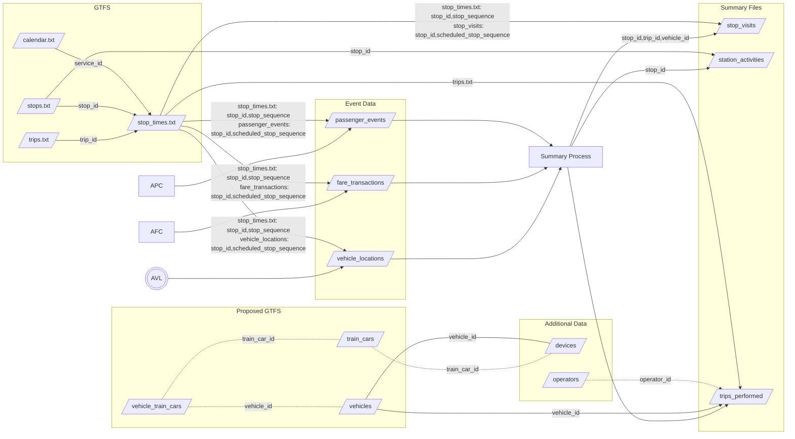

# TIDES Tables Schema

Schemas for TIDES suite.

## Files in Specification

TIDES consists of a package of files as defined in the following table.

**The following table is automatically generated from [`tides.spec.json`]( https://github.com/TIDES-transit/TIDES/blob/main/spec/tides.spec.json)**

{{ frictionless_spec('spec/tides.spec.json') }}

File components for TIDES are specified in [`tides.spec.json`](http://github.com/TIDES-transit/TIDES/blob/main/spec/tides.spec.json) in a format compatible with the
[frictionless data](https://specs.frictionlessdata.io/tabular-data-package/) data package standard.

## Relationships

Files in the TIDES suite are related to each other and other open standards as follows:

