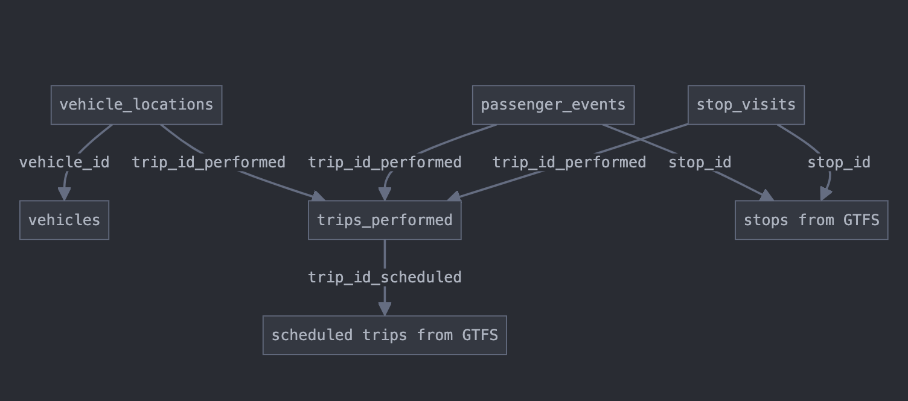

# Use Case Profile: OTP / Delays Analysis

_**Note:** This is a working draft. At various points, we have included references (italicized) to input that have contributed to the creation of this use case profile draft. The full comments from these contributors can be found in the issue: [📄🚀 – OTP/Delays Analysis Use Case Profile Development](https://github.com/TIDES-transit/TIDES/issues/231)._

## Contents

- **Overview and Context**
    - Title, description, priority, and intended audience
    - Problem statement addressing standardization needs for transit delay analysis

- **Use Case Definition**
    - Analytical needs (vehicle delay, passenger delay, spatial and cross-modal analysis)
    - Specific questions categorized by spatial/temporal, passenger impact, and system performance
    - Variations across different agency types and sizes
    - Related use cases and overlaps with other transit analysis domains

- **Required TIDES Tables and Fields**
    - Primary tables (vehicle_locations, trips_performed, stop_visits, passenger_events)
    - Essential fields for each table with detailed descriptions
    - Optional fields that enhance analysis capabilities
    - Minimum data completeness requirements for effective analysis

- **Data Relationships and Integration**
    - Relationships between TIDES tables for delay analysis
    - Integration with external data (GTFS, street networks, weather/event data)
    - Temporal and spatial considerations for comprehensive analysis

- **Implementation Considerations**
    - Common implementation challenges (data volume, quality, performance, schedule linking)
    - Data quality requirements (positional/temporal accuracy, completeness, consistency)
    - Performance considerations for storage, queries, and visualization

- **Extension Points**
    - Areas for extending TIDES (street network integration, advanced metrics, external factors)
    - Examples of extension mechanisms (namespaced fields, extension objects)
    - Potential extensions for promotion to core specification

- **Validation Approach**
    - Specific validation rules (temporal sequence, spatial, relationship, completeness)
    - Data quality thresholds for accuracy and completeness
    - Cross-table validation requirements
    - Validation tool considerations

- **Working Group Tasks and Timeline**
    - Development tasks with deadlines
    - Key questions for resolution
    - Process for community feedback

- **References and Resources**
    - Relevant GitHub discussions and issues
    - External resources and tools

## Overview and Context

**Title:** On-Time Performance and Delay Analysis Use Case Profile

**Description:** This profile defines the requirements, methodologies, and best practices for using TIDES data to analyze transit delays and on-time performance at a granular, actionable level. It covers both vehicle and passenger delay analysis, with a focus on spatial visualization and street network integration.

**Priority:** This use case received the highest number of votes (9) during the April 2025 Contributors Group meeting, making it the top priority for profile development.

**Intended Audience:**

- Transit agency analysts and planners
- Software developers building delay analysis tools
- Consultants performing transit performance analysis
- Researchers studying transit reliability and delay patterns

**Problem Statement:** Transit agencies need to identify, quantify, and visualize delays in their service to improve reliability, reduce passenger wait times, and optimize operations. Current approaches often lack standardization, making it difficult to compare results across different systems or time periods, or to develop reusable analysis tools.

## Use Case Definition

### Analytical Needs

This use case addresses the following analytical needs:

1. **Vehicle Delay Analysis**
   - Identifying locations and times with recurring vehicle delays
   - Quantifying delay magnitude and frequency
   - Analyzing delay patterns by time of day, day of week, season, etc.
   - Correlating delays with external factors (weather, traffic, events)
   - Comparing actual travel times to scheduled times
   - _Re: @botanize's detailed explanation of different delay methodologies including stop-segment and street-segment approaches_

2. **Passenger Delay Analysis**
   - Quantifying passenger-weighted delay (impact on riders)
   - Identifying high-impact delays affecting the most passengers
   - Analyzing passenger wait time and excess wait time
   - Measuring reliability from the passenger perspective
   - _Re: @lauriemerrell's question about passenger weighting with stop_visits level data, which @botanize confirmed is possible using departure load_

3. **Spatial Analysis**
   - Mapping delays to street networks for spatial visualization
   - Identifying delay hotspots and corridors
   - Analyzing segment-level speed and delay patterns
   - Correlating delays with street characteristics (lanes, signals, etc.)
   - _Re: @edasmalchi's work on California Transit Speed Maps using hybrid segments (stop-to-stop but every 1km where stops are farther apart)_

4. **Cross-Modal Analysis**
   - Comparing delay patterns across different transit modes
   - Analyzing transfer reliability between modes
   - Identifying system-wide delay cascades
   - _Re: @lauriemerrell's note about the need to support different methodologies for different modes_

### Specific Questions This Use Case Helps Answer

#### Spatial and Temporal Analysis Questions

- Where and when do the most significant delays occur in the transit system?
- Which route segments consistently experience delays?
- How do delays correlate with ridership, time of day, or external factors?

#### Passenger Impact Questions

- How do delays impact passengers versus vehicles?
- What is the reliability of the transit system from a passenger perspective?

#### System Performance Questions

- What are the recurring patterns in delay occurrence?
- How does actual service compare to scheduled service?
- How do delays propagate through the system?
- _Re: @e-lo and @botanize highlighting the important distinction between schedule adherence (how close to expected travel time) and theoretical minimum travel time (free flow)_

### Variations Across Agency Types/Sizes

- **Large Urban Agencies:** May focus on network-wide delay patterns, transfer reliability, and multi-modal analysis
- **Small/Rural Agencies:** May focus on specific corridors or routes with limited resources for data collection
- **Bus-Only Agencies:** May emphasize street network integration and traffic-related delays
- **Multi-Modal Agencies:** May prioritize cross-modal delay analysis and transfer reliability
- **Rail Agencies:** May focus on terminal delays, dwell time analysis, and cascade effects
- _Re: @lauriemerrell's reference to different reporting approaches at agencies like CTA and MTA_

### Related Use Cases and Overlaps

- **Runtime Analysis:** Significant overlap with analyzing vehicle run times
- **Service Delivery Measurement:** Related to quantifying delivered versus scheduled service
- **Schedule Adherence:** Closely related to measuring on-time performance
- **Maximum Load Point Analysis:** Can be combined with delay analysis to identify high-impact delays
- **Street Network Analysis:** Overlaps with mapping transit performance to street segments
- _Re: @botanize's comment about standard metrics of schedule performance and headway adherence that complement delay analysis_

## Required TIDES Tables and Fields

### Primary Tables

1. **vehicle_locations**
   - Essential for tracking vehicle movements and calculating delays
   - Provides the raw data for speed, location, and timestamp analysis
   - _Re: @botanize's explanation of using vehicle location data for street-segment delay analysis_

2. **trips_performed**
   - Links vehicle movements to specific trips
   - Provides context for scheduled versus actual service
   - _Re: @lauriemerrell's note about schedule linking complexity_

3. **stop_visits**
   - Captures arrival and departure times at stops
   - Essential for stop-level delay analysis
   - _Re: @botanize's description of stop-segment delay analysis using stop visit data_

4. **passenger_events**
   - Provides ridership context for passenger-weighted delay analysis
   - Helps quantify the impact of delays on passengers
   - _Re: @lauriemerrell's question about passenger weighting without passenger-event level granularity_

### Essential Fields

#### vehicle_locations

- `vehicle_id` - Identifies the specific vehicle
- `trip_id_performed` - Links to the specific trip being performed
- `event_timestamp` - Precise time of the location record
- `latitude` / `longitude` - Geographic position
- `speed` - Vehicle speed at the time of recording
- `heading` - Direction of travel
- `scheduled_trip_id` - Reference to scheduled trip in GTFS
- `scheduled_stop_sequence` - Reference to stop sequence in GTFS
- _Re: @botanize's detailed explanation of using vehicle location data for delay analysis_

#### trips_performed

- `trip_id_performed` - Unique identifier for the performed trip
- `service_date` - Date of service
- `vehicle_id` - Vehicle performing the trip
- `trip_id_scheduled` - Reference to scheduled trip in GTFS
- `start_time` / `end_time` - Actual start and end times of the trip
- _Re: @lauriemerrell's note about schedule linking complexity_

#### stop_visits

- `trip_id_performed` - Links to the performed trip
- `stop_id` - Identifies the stop
- `stop_sequence` - Order of the stop in the trip
- `scheduled_arrival_time` / `scheduled_departure_time` - Planned times
- `arrival_time` / `departure_time` - Actual times
- `boarding_count` / `alighting_count` - Passenger activity
- _Re: @botanize's explanation of using stop visit data for passenger-weighted metrics_

#### passenger_events

- `trip_id_performed` - Links to the performed trip
- `stop_id` - Identifies the stop
- `event_timestamp` - Time of the passenger event
- `event_type` - Type of passenger event (boarding, alighting)
- `passenger_count` - Number of passengers involved
- _Re: @lauriemerrell's discussion about passenger weighting options_

### Optional Fields That Enhance Analysis

- **vehicle_locations**
    - `schedule_deviation` - Deviation from schedule in seconds
    - `distance_along_route` - Distance traveled along the route
    - `next_stop_id` - Next scheduled stop
    - `door_status` - Door open/closed status
    - `gps_quality` - Quality indicator for GPS signal

- **trips_performed**
    - `operator_id` - Driver/operator identification
    - `block_id` - Block identifier from scheduling system
    - `route_id` - Route identifier

- **stop_visits**
    - `dwell_time` - Time spent at the stop
    - `schedule_deviation` - Deviation from schedule in seconds
    - `door_open_time` / `door_close_time` - Precise door operation times

### Minimum Data Completeness Requirements

For effective delay analysis, the following minimum requirements are suggested:

1. **Temporal Coverage:**
   - At least 80% of operating hours should have vehicle location data
   - Maximum gap in vehicle location data should not exceed 5 minutes
   - _Re: @botanize's note about temporal stability of data_

2. **Spatial Coverage:**
   - At least 90% of routes should have vehicle location data
   - Vehicle location data should cover at least 80% of each route's length
   - _Re: @edasmalchi's experience with spatial coverage needs for California Transit Speed Maps_

3. **Update Frequency:**
   - Vehicle location data should be collected at least every 30 seconds
   - More frequent collection (10-15 seconds) is recommended for detailed analysis
   - _Re: @botanize's explanation of how update frequency affects spatial resolution_

4. **Stop Visit Completeness:**
   - At least 90% of scheduled stops should have actual arrival/departure times
   - Timepoint stops should have 95%+ coverage
   - _Re: @lauriemerrell's note about timepoint identification challenges_

## Data Relationships and Integration

### Relationships Between TIDES Tables



Key relationships for delay analysis:

1. `vehicle_locations` to `trips_performed` via `trip_id_performed`
2. `stop_visits` to `trips_performed` via `trip_id_performed`
3. `passenger_events` to `stop_visits` via `trip_id_performed` and `stop_id`
4. TIDES data to GTFS data via `trip_id_scheduled` and `stop_id`

- _Re: @lauriemerrell's points about relationship complexity and schedule linking_

### Integration with External Data

#### GTFS Integration

- Link `trip_id_scheduled` in TIDES to `trip_id` in GTFS
- Link `stop_id` in TIDES to `stop_id` in GTFS
- Use GTFS `stop_times.txt` for scheduled arrival and departure times
- Use GTFS `shapes.txt` for route geometry
- _Re: @botanize's suggestion to use the timepoint field in GTFS stop_times.txt_

#### Street Network Integration

- Map vehicle locations to street network segments
- Options include:
    - Open Street Map integration
    - Agency-specific street network data
    - Commercial street data providers
- Consider using shared streets referencing or similar approaches for standardized segment identification
- _Re: @botanize's mention of using both sharedstreets-matcher and in-house processes for street network matching, and @edasmalchi's experience with street network integration at Caltrans_

#### Weather and Event Data

- Timestamp-based integration with weather data
- Integration with special event databases
- Traffic data integration where available
- _Re: @botanize's note about correlating delays with external factors_

### Temporal Considerations

- Historical data needs for trend analysis (recommend at least 6-12 months)
- Time-of-day segmentation for analysis (peak vs. off-peak)
- Day-of-week patterns (weekday vs. weekend)
- Seasonal variations
- Special event impacts
- _Re: @botanize's discussion of stationarity and temporal stability of freeflow speeds_
- _Re: @lauriemerrell's point about time of day bucketing behavior_

### Spatial Considerations

- Route-level analysis
- Stop-level analysis
- Segment-level analysis (between stops)
- Corridor-level analysis (multiple routes)
- Network-wide analysis
- Geographic aggregation (neighborhoods, districts)
- _Re: @botanize's detailed explanation of spatial resolution options_
- _Re: @edasmalchi's hybrid segment approach at Caltrans_

## Implementation Considerations

### Common Implementation Challenges

1. **Data Volume Management**
   - High-frequency vehicle location data can create storage challenges
   - Consider data retention policies and aggregation strategies
   - Balance between granularity and storage requirements
   - _Re: @botanize's note about spatial and temporal resolution tradeoffs_

2. **Data Quality Issues**
   - GPS accuracy in urban canyons or tunnels
   - Missing data points or gaps in coverage
   - Clock synchronization between systems
   - Handling of detours and off-route operations
   - _Re: @botanize's discussion of data quality challenges_

3. **Computational Performance**
   - Processing large volumes of vehicle location data
   - Spatial join operations can be computationally intensive
   - Optimization strategies for real-time or near-real-time analysis
   - _Re: @botanize's experience with computational challenges in street-segment analysis_

4. **Schedule Linking Complexity**
   - Matching actual operations to scheduled service
   - Handling schedule changes and versions
   - Accounting for mid-day schedule adjustments
   - _Re: @lauriemerrell's note about schedule linking challenges_

5. **Cross-Modal Consistency**
   - Ensuring consistent delay definitions across modes
   - Handling mode-specific operational characteristics
   - Integrating data from different source systems
   - _Re: @lauriemerrell's point about different methodologies for different modes_

### Data Quality Requirements

1. **Positional Accuracy**
   - GPS accuracy within 10 meters for reliable street segment matching
   - Consistent heading information
   - _Re: @botanize's discussion of spatial validation needs_

2. **Temporal Accuracy**
   - Clock synchronization across systems
   - Timestamp precision to the second
   - Consistent timezone handling
   - _Re: @botanize's note about temporal sequence validation_

3. **Completeness**
   - Minimal gaps in vehicle tracking
   - Coverage across the entire network
   - Inclusion of all service types
   - _Re: @lauriemerrell's points about data completeness requirements_

4. **Consistency**
   - Consistent data collection methods
   - Stable identifiers across systems
   - Consistent handling of special cases (detours, short turns)
   - _Re: @botanize's discussion of data consistency challenges_

### Performance Considerations

1. **Data Storage**
   - Consider partitioning by service_date for efficient queries
   - Index on trip_id_performed, vehicle_id, and timestamp
   - Consider spatial indexing for location-based queries
   - _Re: @botanize's experience with data volume management_

2. **Query Optimization**
   - Pre-calculate common delay metrics
   - Create materialized views for frequently accessed analyses
   - Consider data aggregation strategies for system-wide analysis
   - _Re: @botanize's approach to calculating freeflow travel times_

3. **Visualization Performance**
   - Aggregate data for system-wide visualizations
   - Consider client-side rendering for interactive maps
   - Implement progressive loading for large datasets
   - _Re: @edasmalchi's experience with California Transit Speed Maps visualization_

## Extension Points

Areas where extensions to the core TIDES specification might be needed:

1. **Street Network Integration**
   - Extensions for linking vehicle positions to street segments
   - Fields for street segment identifiers
   - Fields for relative position along segments
   - _Re: @botanize's experience with street network matching_
   - _Re: @edasmalchi's hybrid segment approach at Caltrans_

2. **Advanced Delay Metrics**
   - Agency-specific delay categorization
   - Custom threshold definitions for delay severity
   - Passenger-weighted metrics
   - _Re: @botanize's definition of delay using "freeflow" travel time as the baseline_
   - _Re: @e-lo's distinction between schedule adherence and theoretical minimum travel time_

3. **External Factor Correlation**
   - Weather condition fields
   - Traffic condition references
   - Special event indicators
   - _Re: @botanize's note about correlating delays with external factors_

4. **Mode-Specific Extensions**
   - Rail-specific delay factors (signal, terminal operations)
   - Bus-specific delay factors (traffic, boarding/alighting time)
   - Mode-specific reliability metrics
   - _Re: @lauriemerrell's point about different methodologies for different modes_

### Using Extension Mechanisms

Example extension using namespaced fields:

```json
{
  "vehicle_id": "1234",
  "trip_id_performed": "trip_5678",
  "event_timestamp": "2025-04-15T08:30:45Z",
  "latitude": 37.7749,
  "longitude": -122.4194,
  "speed": 8.5,
  "agency:street_segment_id": "seg_12345",
  "agency:relative_position": 0.75,
  "agency:traffic_condition": "congested",
  "agency:delay_category": "traffic_signal"
}
```

Example using extension objects:

```json
{
  "vehicle_id": "1234",
  "trip_id_performed": "trip_5678",
  "event_timestamp": "2025-04-15T08:30:45Z",
  "latitude": 37.7749,
  "longitude": -122.4194,
  "speed": 8.5,
  "extensions": {
    "street_network": {
      "segment_id": "seg_12345",
      "relative_position": 0.75
    },
    "delay_factors": {
      "traffic_condition": "congested",
      "delay_category": "traffic_signal"
    }
  }
}
```

- _Re: @botanize's detailed explanation of street network matching approaches_

### Potential Extensions for Promotion

Extensions that might be considered for promotion to the core specification:

1. Street segment reference fields for vehicle_locations
2. Standardized delay categorization fields
3. Weather and traffic condition references
4. Passenger-weighted delay metrics

- _Re: @edasmalchi's experience with street network integration at Caltrans, and @botanize's "freeflow" travel time definition that could be standardized_

## Validation Approach

### Specific Validation Rules

1. **Temporal Sequence Validation**
   - Vehicle locations should have monotonically increasing timestamps
   - Stop arrivals should precede departures at the same stop
   - Trip start times should precede end times
   - _Re: @botanize's discussion of temporal validation needs_

2. **Spatial Validation**
   - Vehicle positions should be within reasonable distance of the route
   - Sequential positions should represent physically possible movement
   - Speed values should be within reasonable ranges
   - _Re: @botanize's experience with spatial validation challenges_

3. **Relationship Validation**
   - Every vehicle_location should have a valid trip_id_performed
   - Every stop_visit should reference a valid stop_id
   - Referenced trips_performed should exist
   - _Re: @lauriemerrell's points about relationship complexity_

4. **Completeness Validation**
   - Check for gaps in vehicle tracking
   - Verify coverage of all scheduled trips
   - Ensure all timepoints have arrival/departure times
   - _Re: @lauriemerrell's note about timepoint identification challenges_

### Data Quality Thresholds

Suggested thresholds for data quality:

1. **Temporal Accuracy**
   - 95% of records within 1 second of actual time
   - No more than 5% of records with timestamp errors
   - _Re: @botanize's discussion of temporal accuracy requirements_

2. **Spatial Accuracy**
   - 90% of positions within 10 meters of actual location
   - No more than 2% of positions with gross errors (>100m)
   - _Re: @botanize's experience with spatial accuracy challenges_

3. **Completeness**
   - At least 95% of scheduled trips represented
   - At least 90% of vehicle hours covered
   - No more than 5% of data with gaps >5 minutes
   - _Re: @lauriemerrell's points about data completeness requirements_

### Cross-Table Validation

1. **Consistency Between vehicle_locations and stop_visits**
   - Vehicle positions near stops should align with stop_visits timestamps
   - Direction of travel should be consistent with stop sequence
   - _Re: @botanize's experience with cross-table validation_

2. **Consistency Between stop_visits and passenger_events**
   - Passenger boardings/alightings should occur during stop dwell times
   - Total boardings/alightings should be consistent between tables
   - _Re: @lauriemerrell's discussion about passenger data consistency_

3. **Consistency Between trips_performed and vehicle_locations**
   - Vehicle locations should exist for the duration of the trip
   - First/last vehicle locations should align with trip start/end times
   - _Re: @botanize's note about trip and location data consistency_

### Validation Tool Considerations

1. **Schema Validation**
   - JSON Schema validation for structural correctness
   - Field type and format validation
   - _Re: @lauriemerrell's points about validation approaches_

2. **Business Rule Validation**
   - Custom validation for transit-specific business rules
   - Temporal and spatial consistency checks
   - _Re: @botanize's discussion of business rule validation needs_

3. **Quality Metric Reporting**
   - Data completeness metrics
   - Accuracy assessments
   - Coverage statistics
   - _Re: @lauriemerrell's note about parameterizable thresholds_

4. **Visualization of Validation Results**
   - Maps of data coverage and quality
   - Temporal graphs of data completeness
   - Summary dashboards for data quality
   - _Re: @edasmalchi's experience with visualization at Caltrans_

## Working Group Tasks and Timeline

### Tasks for OTP/Delays Analysis Profile Development

1. **Initial Research and Scoping (By May 24)**
   - Review existing delay analysis methodologies
   - Identify common metrics and approaches
   - Document agency variations in delay analysis
   - _Re: @botanize, @lauriemerrell, and @edasmalchi's contributions to this research_

2. **Field Requirements Definition (By May 31)**
   - Identify essential fields for delay analysis
   - Document field relationships and dependencies
   - Define minimum data quality requirements
   - _Re: @lauriemerrell's discussion of field requirements_

3. **Implementation Patterns Documentation (By June 7)**
   - Document common implementation approaches
   - Identify technical challenges and solutions
   - Develop example implementation patterns
   - _Re: @botanize's detailed implementation approaches_
   - _Re: @edasmalchi's experience with California Transit Speed Maps_

4. **Draft Profile Development (By June 12)**
   - Compile research into draft profile
   - Develop validation approach
   - Document extension points
   - _Thank you to all contributors for their insights that shaped this profile_

5. **Community Review Preparation (By June 12)**
   - Prepare presentation for Contributors Group
   - Identify key discussion points
   - Develop examples for illustration
   - _Re: @botanize, @lauriemerrell, @edasmalchi, and @e-lo's contributions to the discussion_

### Key Questions for Resolution

1. How should delay be defined and measured consistently across different transit modes?
   - _Re: @botanize's "freeflow" travel time definition_
   - _Re: @e-lo's distinction between schedule adherence and theoretical minimum travel time_

2. What are the minimum data requirements for meaningful delay analysis?
   - _Re: @botanize's discussion of spatial and temporal resolution requirements_
   - _Re: @lauriemerrell's points about data completeness_

3. How should passenger impact be incorporated into delay metrics?
   - _Re: @lauriemerrell's question about passenger weighting with stop_visits level data_
   - _Re: @botanize's approach using departure load_

4. What are the best approaches for integrating with street networks?
   - _Re: @botanize's experience with street network matching_
   - _Re: @edasmalchi's hybrid segment approach at Caltrans_

5. How should validation tools verify data suitability for delay analysis?
   - _Re: @lauriemerrell's points about validation approaches_
   - _Re: @botanize's discussion of validation needs_

### Process for Community Feedback

1. Share draft profile with Implementers and Contributors groups
2. Present at June 12 Contributors Group meeting
3. Collect feedback through GitHub discussions
   - Best practices

4. **Examples and Illustrations**
   - Example queries
   - Sample visualizations
   - Implementation patterns
   - Code snippets
   - _Re: @botanize's detailed implementation approaches_
   - _Re: @edasmalchi's experience with California Transit Speed Maps_

5. **Validation Guidelines**
   - Data quality requirements
   - Validation approaches
   - Quality thresholds
   - Validation tools
   - _Re: @lauriemerrell's points about validation approaches_

## References and Resources

### Relevant GitHub Discussions/Issues

- [GitHub Discussion: Help Shape the TIDES Implementation Guide](https://github.com/TIDES-transit/TIDES/discussions/230)
- [Issue #99: Accommodate other types of instantaneous events](https://github.com/TIDES-transit/TIDES/issues/99)
- [Issue #151: Specify schedule data set when more than one is used on a single service date](https://github.com/TIDES-transit/TIDES/issues/151)
- [Issue #231: OTP/Delays Analysis Use Case Profile Development](https://github.com/TIDES-transit/TIDES/issues/231)
    - _Special thanks to @botanize, @lauriemerrell, @edasmalchi, and @e-lo for their valuable contributions to this issue_

### External Resources

- [Shared Streets](https://sharedstreets.io/) - Reference system for street segment identification
    - _Re: @botanize's mention of using sharedstreets-matcher_
- [GTFS-ride](https://github.com/ODOT-PTS/GTFS-ride) - Related standard for ridership data
- [Transit Center's Bus Delay Toolkit](https://transitcenter.org/publication/bus-delay-toolkit/)
- [TCRP Report 113: Using Archived AVL-APC Data to Improve Transit Performance and Management](http://www.trb.org/Publications/Blurbs/153537.aspx)
- [California Transit Speed Maps](https://dot.ca.gov/cal-transit-speed-maps) - Caltrans tool for transit speed analysis
    - _Re: @edasmalchi's work at Caltrans_
